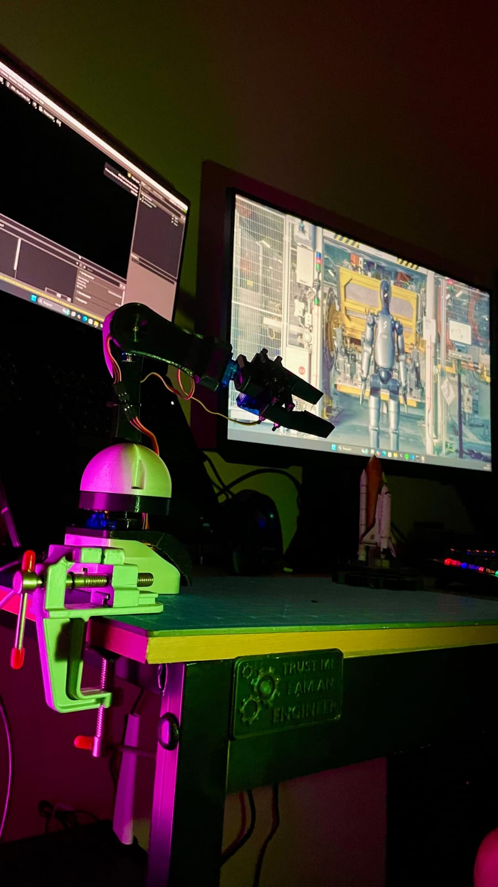
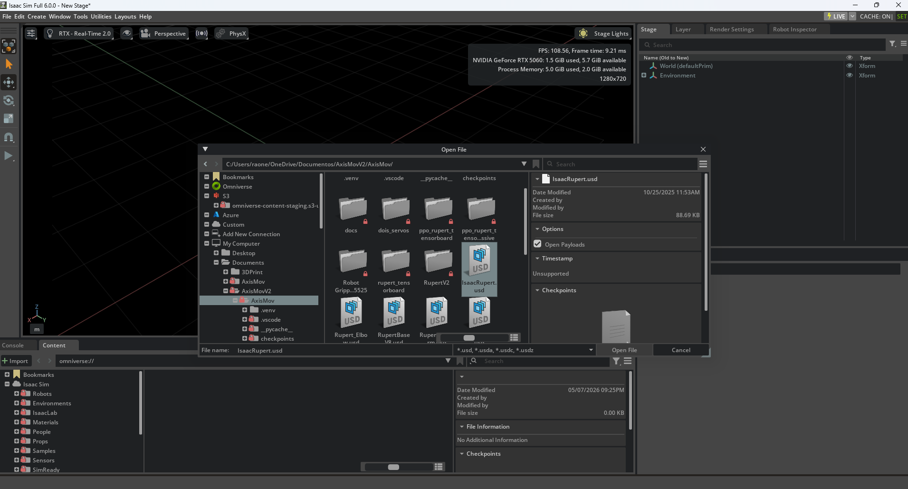
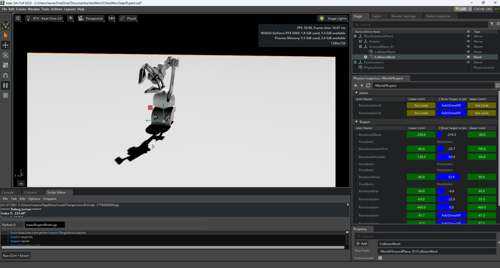

# Rupert

<p align="center">
  
</p>

> **Work in progress.** Rupert is an actively developed platform — control models, simulation, and hardware are continuously being improved. Expect rough edges.

Rupert is a 5-DOF robotic arm built from 3D-printed parts and off-the-shelf components, designed as a low-cost Physical AI testbed. It is the first robot of the [AxisMov](https://github.com/RaoneGSC/axismov) platform.

The main interest of the project is the **sim-to-real pipeline**: training or controlling the robot in simulation (NVIDIA Isaac Sim) and transferring that directly to the physical hardware via serial communication.

---

## Architecture

Rupert is split into two layers:

- **Brain** (`src/brain/`) — runs on the PC, handles simulation, AI, and high-level control
- **Firmware** (`firmware/`) — runs on the Raspberry Pi Pico 2, drives the servos directly

```
PC (Brain)  ──── USB Serial (230400 baud) ────  Pico 2 (Firmware)  ──── PWM ────  Servos
```

---

## Firmware — Peripheral Nervous System

`firmware/peripheral_system.py` is the MicroPython script that runs on the **Raspberry Pi Pico 2**. Flash it using [Thonny](https://thonny.org/) or `mpremote`.

It listens on USB serial for commands in the format:

```
angle0,angle1,angle2,angle3,angle4\n
```

And responds with:

```
OK,angle0,angle1,angle2,angle3,angle4
```

Or `ERR,FORMAT` / `ERR,<message>` on failure. On startup it prints `READY`.

| Pin | Joint | Servo | Notes |
|---|---|---|---|
| 15 | Base | SG92R | carbon fiber gears — handles higher torque |
| 14 | Shoulder | MG90S | metal gear — highest load area |
| 13 | Elbow | SG92R | carbon fiber gears — handles higher torque |
| 12 | Wrist | SG90 | opens/closes gripper |
| 19 | Gripper | SG90 | wrist rotation |

---

## Brain Modules

Rupert has multiple control interfaces, each in `src/brain/`:

| File | Description |
|---|---|
| `IsaacRupertBrain.py` | **Main sim-to-real bridge** — reads joint positions from Isaac Sim and streams them to the Pico via serial |
| `RupertBrainV3.py` | Keyboard-based direct control of the physical robot |
| `RupertBrainPyBulletV2.py` | PyBullet simulation + serial bridge ⚠️ partial assembly (2-DOF only) |
| `RupertBrainPyBulletV1.py` | First PyBullet prototype ⚠️ partial assembly |
| `RupertPhysicalAI.py` | Natural language control via LangChain + Groq |
| `src/mcp/RupertMCP.py` | MCP server — control Rupert directly from Claude Desktop |

> ⚠️ The PyBullet scripts and RL training environment (`src/training/`) model a **partial, 2-DOF version** of Rupert, not the full 5-DOF assembly. Full-assembly RL training is on the roadmap.

---

## Sim-to-Real with NVIDIA Isaac Sim

The most developed pipeline uses **Isaac Sim** as the simulation environment. The robot is controlled in simulation and commands are streamed to the physical hardware in real time.

**Requirements:** [NVIDIA Isaac Sim](https://developer.nvidia.com/isaac/sim) (6.0+)

### Step 1 — Open the scene

Launch Isaac Sim, go to **File → Open**, navigate to the `assets/usd/` folder and open `IsaacRupert.usd`.

<p align="center">
  
</p>

### Step 2 — Flash the firmware

Flash `firmware/pico_servo_protected.py` to the Raspberry Pi Pico 2 using Thonny or `mpremote`. Connect the Pico via USB and confirm the COM port in `IsaacRupertBrain.py`.

### Step 3 — Run the brain script

Once the scene loads you should see Rupert in the viewport with all joints visible in the Physics Inspector.

<p align="center">
  
</p>

Open the **Script Editor** (bottom panel), load `src/brain/IsaacRupertBrain.py` and hit **Run (Ctrl+Enter)**.

The script will:
1. Connect to the Pico via serial (`COM4`, 230400 baud)
2. Start a smooth ramp from 90° to the current simulation position
3. Stream joint angles to the robot at 50Hz

---

## Hardware

Rupert is fully 3D-printable. All parts use **M3 screws**. STL and USD files are in `assets/`.

| Component | Details |
|---|---|
| Microcontroller | Raspberry Pi Pico 2 |
| Motor driver | [Kitronik Simply Robotics Motor Driver Board for Raspberry Pi Pico](https://kitronik.co.uk/products/5331-simply-robotics-motor-driver-board-for-raspberry-pi-pico) |
| Base servo (pin 15) | SG92R — carbon fiber gears |
| Shoulder servo (pin 14) | MG90S — metal gear, highest load area |
| Elbow servo (pin 13) | SG92R — carbon fiber gears |
| Wrist servo (pin 12) | SG90 |
| Gripper servo (pin 19) | SG90 |
| Communication | USB Serial, 230400 baud |
| Fasteners | M3 screws |

---

## Known Issues

Rupert is a work in progress. These are the known limitations currently being addressed:

### Physical

- **Shoulder / Elbow torque** — Even with MG996R servos, the arm length generates more torque than the servos can handle. Movements in these joints are unreliable under load. Planned fix: shorten arm and forearm to reduce required torque.

- **Gripper grip strength** — The current gripper design does not hold objects reliably. For testing, use very lightweight objects (paper, foam). A redesigned gripper with better mechanical advantage is planned.

### Software / Simulation

- **Isaac Sim gripper joints** — The gripper joint connections in `IsaacRupert.usd` have structural issues that can crash the simulation depending on the movement. Needs a clean USD rebuild of the gripper assembly.

- **Ground constraint artifact** — The base is fixed to the ground plane to prevent tipping, which creates unnatural behavior in some poses. A proper base mass/inertia model is the correct fix.

- **PyBullet / RL is 2-DOF only** — The training environment and PyBullet scripts model a simplified 2-joint version of Rupert. Full 5-DOF RL environment is planned.

---

## Roadmap

- [ ] **Isaac Sim MCP** — MCP server using the Omniverse API to let Claude control the simulation directly, closing the loop between natural language and sim-to-real
- [ ] **Computer vision module** — Low-cost webcam integration for spatial awareness, with optional basic radar assist, so Rupert can perceive and react to objects around it
- [ ] **Full 5-DOF RL environment** — Extend the Gymnasium environment to the complete arm assembly
- [ ] **Shorter arm/forearm** — Redesign to reduce torque on shoulder and elbow joints
- [ ] **Gripper redesign** — Better mechanical advantage for reliable grasping

---

## Setup

```bash
git clone https://github.com/RaoneGSC/rupert.git
cd rupert
pip install -r requirements.txt
cp .env.example .env   # add your API keys if using RupertPhysicalAI or Autogen
```

Flash the firmware to the Pico separately via Thonny or `mpremote copy firmware/peripheral_system.py :main.py`.

---

## License

MIT
